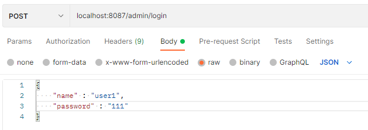
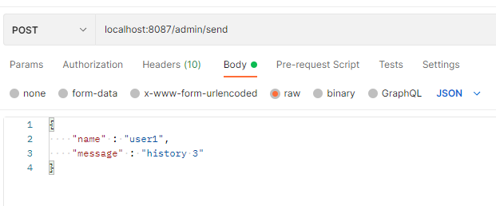
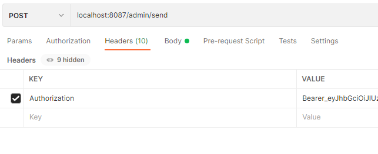
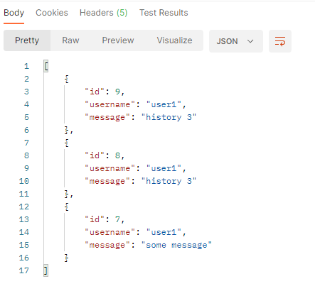

# Welcome to app-data


> Приложение, которое проверяет данные пользователя при авторизации, выдает jwt-токен в случае успеха, 
> проверяет переданный пользователем токен, сохраняет сообщения в БД и отправляет список последних сообщений.


## Автор

👤 **Yuri Kaleganov**

* Github: [@Yuri_Kaleganov](https://github.com/Hebsat)

## Описание работы

Приложение работает с БД MySQL. Использует порт 8087. Необходимо наличие БД app_data и app_data-test. 
Все настройки указаны в application.properties.

В контроллере указаны 2 эндпойнта: /admin/login и /admin/send.
По адресу /admin/login принимает логин и пароль в POST запросе, в теле JSON вида:
```json
{
  "name": "имя отправителя",
  "password": "пароль"
}
```
Сначала проверяет имя пользователя. Если пользователь с таким именем отсутствует в БД, возвращает 400 Bad Request (Invalid username в теле ответа).
При наличии пользователя проверяет пароль. При несовпадении возвращает 400 Bad Request (Invalid password в теле ответа).
При успешной проверке генерирует jwt-токен и отправляет его в виде
```json
{
  "token": "сгенерированный токен"
}
```
В токене содержится имя пользователя, время выдачи и срок окончания. По умолчанию токен действует 30 дней.
Срок действия и ключ можно изменить в application.properties.


При обращении к POST /admin/send контроллер принимает jwt-токен в заголовке и JSON в теле
```json
{
  "name":       "имя отправителя",
  "message":    "текст сообщение"
}
```
Происходит проверка токена. Если истек срок действия или не совпадает имя пользователя возвращает 403 Forbidden (Token validate failed в теле)
После успешной проверки токена сохраняет сообщение. Далее происходит проверка этого сообщения. 
Если оно вида 
```json
{
  "name":       "имя отправителя",
  "message":    "history X"
}
```
то получет Х последних сообщений из БД и возвращает их в теле ответа. 

## Запросы для обращения через терминал

Логин:<br>
```
curl -H "Content-Type: application/json" -X POST -d "{\"name\":\"user1\",\"password\":\"111\"}" http://localhost:8087/admin/login
```
```
curl -H "Content-Type: application/json" -X POST -d '{"name":"user1","password":"111"}' http://localhost:8087/admin/login
```
для успешной авторизации на localhost:8087/admin/login отправить 
```json
{
  "name" : "user1",
  "password" : "111"
}
```
(в сгенерированной БД существует пользаватель user1 с паролем 111)




Посылка сообщения:<br> 
```
curl -X POST -H "Authorization: Bearer_eyJhbGciOiJIUzI1NiJ9.eyJzdWIiOiJ1c2VyMSIsImlhdCI6MTY2MTUwODU3OCwiZXhwIjoxNjY0MTAwNTc4fQ.DfO96ZYAVsoJqpIrIZ0kGPxgNVOvvPFvHae5CGiHoeU" -H "Content-Type: application/json" -d "{\"name\":\"user1\",\"message\":\"history 3\"}" http://localhost:8087/admin/send
```
```
curl -X POST -H "Authorization: Bearer_eyJhbGciOiJIUzI1NiJ9.eyJzdWIiOiJ1c2VyMSIsImlhdCI6MTY2MTUwODU3OCwiZXhwIjoxNjY0MTAwNTc4fQ.DfO96ZYAVsoJqpIrIZ0kGPxgNVOvvPFvHae5CGiHoeU" -H "Content-Type: application/json" -d '{"name":"user1","message":"history 3"}' http://localhost:8087/admin/send
```
на localhost:8087/admin/send отправить
```json
{
  "name" : "user1",
  "message" : "history 3"
}
```



Также указать заголовок Authorization: Bearer_eyJhbGciOiJIUzI1NiJ9.eyJzdWIiOiJ1c2VyMSIsImlhdCI6MTY2MTUwODU3OCwiZXhwIjoxNjY0MTAwNTc4fQ.DfO96ZYAVsoJqpIrIZ0kGPxgNVOvvPFvHae5CGiHoeU
(действующий jwt-токен)



В указанном примере будет получено 3 сообщения



